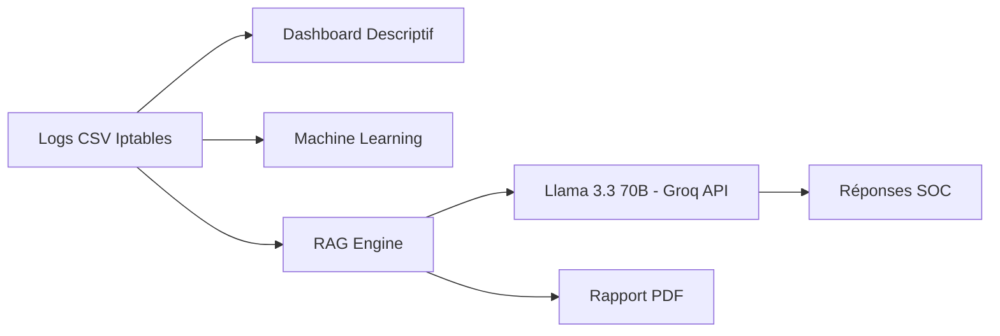
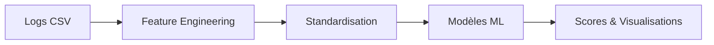
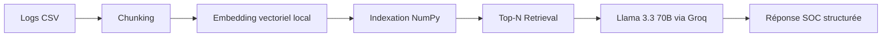

# 🛡️ Challenge SISE x OPSIE — Plateforme Complète d’Analyse Cyber

## 🎯 Présentation du Projet

Ce projet regroupe **trois modules complémentaires** pour l’analyse avancée de logs Iptables :

1. 📊 Dashboard descriptif interactif  
2. 🤖 Module Machine Learning (détection & classification)  
3. 🧠 Module RAG + LLM (SENTINEL SOC Assistant)

L'objectif est de proposer une **chaîne complète d’analyse sécurité** allant de la visualisation simple jusqu’à l’assistance SOC augmentée par LLM.

---

# 🏗️ Architecture Globale

## Vue d’ensemble



---

# 📦 Structure du Projet

```
Challenge-SISExOPSIE/
│
├── views/
│   ├── dashboard.py
│   ├── ml_analysis.py
│   ├── llm_expert.py
│
├── data/
│   └── data_exm.csv
│
├── .env
├── requirements.txt
└── app.py (ou point d’entrée principal)
```

---

# 📊 1️⃣ Dashboard Descriptif

Fonctionnalités :

- Vue globale des flux Permit / Deny
- Filtres par protocole et plage de ports (RFC 6056)
- Analyse TCP vs UDP
- Top IP sources
- Distribution des ports
- Export CSV

Permet une **exploration visuelle rapide et opérationnelle**.

---

# 🤖 2️⃣ Module Machine Learning

Modèles implémentés :

- Isolation Forest (détection anomalies)
- LOF (densité locale)
- K-Means (clustering)
- Régression Logistique
- Arbre CART
- Random Forest
- ACP (visualisation factorielle)

Pipeline simplifié :



---

# 🧠 3️⃣ Module RAG + LLM (SENTINEL)

## Architecture RAG



## 🔎 Fonctionnement

1. Les logs sont transformés en chunks textuels.
2. Chaque chunk est vectorisé (embedding local 512 dimensions).
3. Les embeddings sont indexés en mémoire.
4. Lorsqu’une question est posée :
   - La requête est vectorisée.
   - Les Top-N chunks les plus similaires sont récupérés.
   - Injectés dans le prompt LLM.
5. Le modèle Llama 3.3 70B génère une réponse structurée.

---

# 🔑 Configuration du LLM (Groq)

Le module LLM utilise **Groq API** avec le modèle :

```
llama-3.3-70b-versatile
```

## Étapes :

1️⃣ Aller sur :  
https://console.groq.com/

2️⃣ Créer un compte

3️⃣ Générer une clé API

4️⃣ Créer un fichier `.env` à la racine du projet :

```
GROQ_API_KEY=VOTRE_CLE_ICI
```

⚠️ Ne jamais commit ce fichier sur GitHub.

---

# 🐳 Lancer avec Docker

## 1️⃣ Construire l’image

Depuis la racine du projet :

```
docker build -t sentinel-soc .
```

## 2️⃣ Lancer le conteneur

```
docker run -p 8501:8501 --env-file .env sentinel-soc
```

Puis ouvrir dans le navigateur :

```
http://localhost:8501
```

---

# 💻 Lancement Local (sans Docker)

Créer un environnement virtuel :

```
python -m venv venv
```

Activer :

Windows :
```
venv\Scripts\activate
```

Mac/Linux :
```
source venv/bin/activate
```

Installer les dépendances :

```
pip install -r requirements.txt
```

Lancer :

```
streamlit run app.py
```

---

# 📄 Génération Rapport PDF

Le module RAG permet :

- Génération automatique d’un rapport structuré
- Export PDF professionnel
- Basé uniquement sur les données réelles

---

# 🔐 Sécurité & Bonnes Pratiques

- Clé API stockée dans `.env`
- RAG strictement basé sur données locales
- Prompt contraint pour éviter hallucinations
- Aucun accès externe aux logs

---

# 🚀 Résumé Final

Ce projet démontre une intégration complète :

- Data Engineering
- Visualisation interactive
- Machine Learning
- RAG intelligent
- LLM avancé
- Génération de rapports professionnels

Une plateforme SOC moderne combinant :

Dashboard + IA + Automatisation + Explicabilité.

