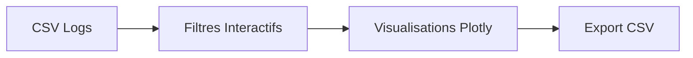

# 📊 Module Dashboard — Analyse Descriptive Interactive

## 🎯 Objectif

Fournir une analyse descriptive interactive des logs Iptables.

---

# 🏗️ Architecture

---

# 📈 Sections Principales

## 1️⃣ Vue d’Ensemble
- Total flux
- Permit
- Deny
- IP sources uniques
- Ports distincts

## 2️⃣ Filtres
- Protocole (TCP / UDP)
- Plage RFC 6056 :
  - System Ports
  - User Ports
  - Dynamic Ports
  - Personnalisée

## 3️⃣ Analyse Temporelle
- Volume quotidien
- Range selector dynamique

## 4️⃣ TCP vs UDP
- Totaux
- Taux de blocage
- Top 5 ports

## 5️⃣ Distribution RFC 6056
- Donut chart
- Barplot empilé Permit/Deny

## 6️⃣ Top IP Sources
- Barplot Top 5
- Scatter Destinations vs Rejets

## 7️⃣ Ports Privilégiés (<1024)
- Services connus (SSH, HTTP, DNS, etc.)

## 8️⃣ Données Brutes
- Filtres avancés
- Téléchargement CSV

---

# ⚙️ Choix Techniques

- @st.cache_data pour performance
- Plotly pour interactivité avancée
- Design system cohérent

